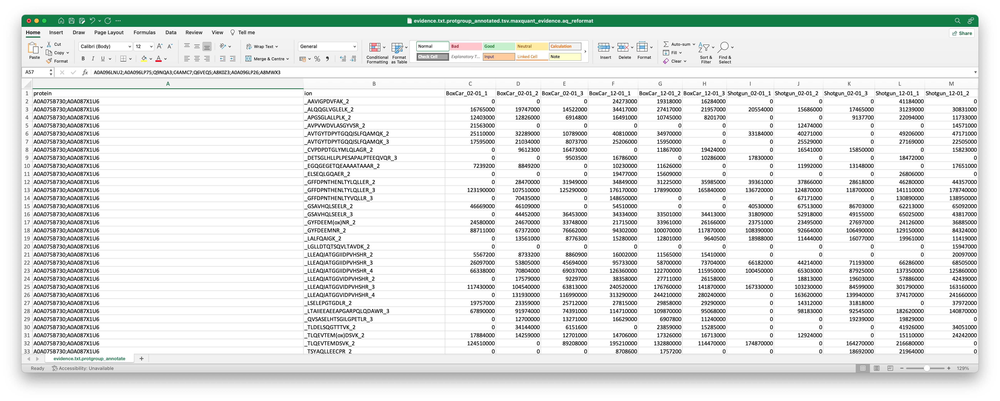
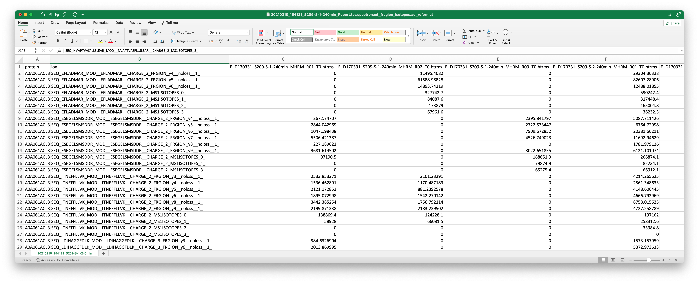

<!---


[](https://pepy.tech/project/alphaquant)
[](https://pepy.tech/project/alphaquant)
[](https://pepy.tech/project/alphaquant)
-->


# AlphaQuant
AlphaQuant is an open-source Python package for sensitive proteomics quantification. You can process MS data analyzed by Spectronaut, DIANN, [AlphaPept](https://github.com/MannLabs/alphapept) or MaxQuant using a Graphical User Interface (GUI) or the python package. The current focus is on the comparison of two biological conditions (i.e. "making volcano plots"), with multi-condition functionality to be added soon.

It is part of the AlphaPept ecosystem from the [Mann Labs at the Max Planck Institute of Biochemistry](https://www.biochem.mpg.de/mann) and the [University of Copenhagen](https://www.cpr.ku.dk/research/proteomics/mann/). To enable all hyperlinks in this document, please view it at [GitHub](https://github.com/MannLabs/alphaquant).

* [**About**](#about)
* [**License**](#license)
* [**Installation**](#installation)
  * [**One-click GUI**](#one-click-gui)
<!---  * [**Pip installer**](#pip) -->
  * [**Developer installer**](#developer)
* [**Usage**](#usage)
  * [**GUI**](#gui)
<!---  * [**CLI**](#cli) -->
  * [**Python and jupyter notebooks**](#python-and-jupyter-notebooks)
* [**Troubleshooting**](#troubleshooting)
* [**Citations**](#citations)
* [**How to contribute**](#how-to-contribute)
* [**Changelog**](#changelog)

---
## About
The standard approach for proteomics quantification is the calculation of point estimates that reflect the abundance of a particular protein. This approach usually neglects a large part of the quantitative information that is available, including the type, quality and reliability of the underlying, quantified peptides. AlphaQuant introduces a collection of novel Bioinformatics algorithms for increased accuracy and sensitivity of proteomics quantification. It is built on the foundation of the [MS-EmpiRe](https://doi.org/10.1074/mcp.RA119.001509) algorithm. 
Alphaquant is an open-source Python package of the AlphaPept ecosystem from the [Mann Labs at the Max Planck Institute of Biochemistry](https://www.biochem.mpg.de/mann) and the [University of Copenhagen](https://www.cpr.ku.dk/research/proteomics/mann/).

---
## License

AlphaQuant was developed by the [Mann Labs at the Max Planck Institute of Biochemistry](https://www.biochem.mpg.de/mann) and the [University of Copenhagen](https://www.cpr.ku.dk/research/proteomics/mann/) and is freely available with an [Apache License](LICENSE.txt). External Python packages (available in the [requirements](requirements) folder) have their own licenses, which can be consulted on their respective websites.

---
## Installation

AlphaQuant can be installed and used on all major operating systems (Windows, macOS and Linux).
There are currently two different types of installation possible:

* [**One-click GUI installer:**](#one-click-gui) Choose this installation if you only want the GUI and/or keep things as simple as possible.
<!---
* [**Pip installer:**](#pip) Choose this installation if you want to use AlphaQuant as a Python package in an existing Python 3.8 environment (e.g. a Jupyter notebook). If needed, the GUI and CLI can be installed with pip as well.
-->
* [**Developer installer:**](#developer) Choose this installation if you are familiar with CLI tools, [conda](https://docs.conda.io/en/latest/) and Python. This installation allows access to all available features of AlphaQuant and even allows to modify its source code directly. Generally, the developer version of AlphaQuant outperforms the precompiled versions which makes this the installation of choice for high-throughput experiments.

### One-click GUI

The GUI of AlphaQuant is a completely stand-alone tool that requires no knowledge of Python or CLI tools. **It currently only supports comparison of two conditions**. Click on one of the links below to download the latest release for:

* [**Windows**](https://github.com/MannLabs/alphaquant/releases/latest/download/alphaquant_gui_installer_windows.exe)
* [**macOS**](https://github.com/MannLabs/alphaquant/releases/latest/download/alphaquant_gui_installer_macos.pkg)
* [**Linux**](https://github.com/MannLabs/alphaquant/releases/latest/download/alphaquant_gui_installer_linux.deb)

Older releases remain available on the [release page](https://github.com/MannLabs/alphaquant/releases), but no backwards compatibility is guaranteed.

<!---
### Pip

AlphaQuant can be installed in an existing Python 3.8 environment with a single `bash` command. *This `bash` command can also be run directly from within a Jupyter notebook by prepending it with a `!`*:

```bash
pip install alphaquant
```

Installing AlphaQuant like this avoids conflicts when integrating it in other tools, as this does not enforce strict versioning of dependancies. However, if new versions of dependancies are released, they are not guaranteed to be fully compatible with AlphaQuant. While this should only occur in rare cases where dependencies are not backwards compatible, you can always force AlphaQuant to use dependancy versions which are known to be compatible with:

```bash
pip install "alphaquant[stable]"
```

NOTE: You might need to run `pip install pip==21.0` before installing AlphaQuant like this. Also note the double quotes `"`.

For those who are really adventurous, it is also possible to directly install any branch (e.g. `@development`) with any extras (e.g. `#egg=alphaquant[stable,development-stable]`) from GitHub with e.g.

```bash
pip install "git+https://github.com/MannLabs/alphaquant.git@development#egg=alphaquant[stable,development-stable]"
```
-->
### Developer

AlphaQuant can also be installed in editable (i.e. developer) mode with a few `bash` commands. This allows to fully customize the software and even modify the source code to your specific needs. When an editable Python package is installed, its source code is stored in a transparent location of your choice. While optional, it is advised to first (create and) navigate to e.g. a general software folder:

```bash
mkdir ~/folder/where/to/install/software
cd ~/folder/where/to/install/software
```

***The following commands assume you do not perform any additional `cd` commands anymore***.

Next, download the AlphaQuant repository from GitHub either directly or with a `git` command. This creates a new AlphaQuant subfolder in your current directory.

```bash
git clone https://github.com/MannLabs/alphaquant.git
```

For any Python package, it is highly recommended to use a separate [conda virtual environment](https://docs.conda.io/en/latest/), as otherwise *dependancy conflicts can occur with already existing packages*.

```bash
conda create --name alphaquant python=3.8 -y
conda activate alphaquant
```

Finally, install AlphaQuant:

```bash
pip install -e ./alphaquant
```
By using the editable flag `-e`, you can make modifications to the [alphaquant source code](alphaquant) and these modifications will be directly reflected when running AlphaQuant.

Some details: By default this installs loose dependancies (no explicit versioning). It is also possible to use stable dependencies and/or install additional [development dependencies](requirements/requirements_development.txt), which allows to make use of more features (the call is then a bit more complex and could be e.g. `pip install -e "./alphaquant[stable,development-stable]"`).


---
## Usage

There are two ways to use AlphaQuant:

* [**GUI**](#gui)
<!---* [**CLI**](#cli)-->
* [**Python**](#python-and-jupyter-notebooks)

NOTE: The first time you use a fresh installation of AlphaQuant, it is often quite slow because some functions might still need compilation on your local operating system and architecture. Subsequent use should be a lot faster.

### GUI

If the GUI was not installed through a one-click GUI installer, it can be activate with the following `bash` command:

```bash
alphaquant gui
```

Note that this needs to be prepended with a `!` when you want to run this from within a Jupyter notebook. When the command is run directly from the command-line, make sure you use the right environment (activate it with e.g. `conda activate alphaquant` or set an alias to the binary executable (can be obtained with `where alphaquant` or `which alphaquant`)).

<!---
### CLI

The CLI can be run with the following command (after activating the `conda` environment with `conda activate alphaquant` or if an alias was set to the AlphaQuant executable):

```bash
alphaquant -h
```

It is possible to get help about each function and their (required) parameters by using the `-h` flag.
-->

### Python and Jupyter notebooks

AlphaQuant can be imported as a Python package into any Python script or notebook with the command `import alphaquant`.
Running the standard analysis (with plots) can be done via the command:
```bash
import alphaquant.diff_analysis_manager as diffmgr

diffmgr.run_pipeline(input_file=input_file, samplemap_file=samplemap_file, results_dir=results_dir, runtime_plots=True))
```

<!---
A brief [Jupyter notebook tutorial](nbs/tutorial.ipynb) on how to use the API is also present in the [nbs folder](nbs).
-->


## Preparing input files

### Spectronaut
AlphaQuant takes a Spectronaut .tsv table as input. When exporting from Spectronaut, the correct columns need to be selected. These can be obtained by downloading one of the export schemes available below. We provide one export scheme for sprecursor quantification and one export scheme for fragment ion quantification. Fragment ion quantification shows slightly more accuracy, but the files are around 10 times larger.

An export scheme can then simply be loaded into Spectronaut as follows:

Go to the "Report" perspective in Spectronaut, click "Import Schema" and provide the file.

The data needs to be exported in the normal long format as .tsv file


<a href="https://github.com/MannLabs/AlphaQuant/raw/master/alphaquant/config/spectronaut_tableconfig_precursor.rs" download>Download Spectronaut export scheme for precursor quantification</a>

<a href="https://github.com/MannLabs/AlphaQuant/raw/master/alphaquant/config/spectronaut_tableconfig_fragion.rs" download>Download Spectronaut export scheme for fragment ion quantification</a>

<a href="https://github.com/MannLabs/AlphaQuant/raw/master/alphaquant/config/spectronaut_tableconfig_ptm_fragion.rs" download>Download Spectronaut export scheme for fragment ion quantification WITH PTM </a>


### DIA-NN
Provide the path to the DIANN "report.tsv" output table.

### MaxQuant
Provide the path to the MaxQuant "peptides.txt" output table or the MaxQuant evidence.txt output table. Additionally and if possible, provide the path to the corresponding "proteinGroups.txt" file.

### FragPipe
Provide the path to the "combined_ion.tsv" output table.


### generic input format
In the case that you working with a search engine that is not supported by AlphaQuant, you can use the generic input format. This format is a tab-separated quantity matrix file with the following columns: "protein", "ion", "run_id1", "run_id2", ..,"run_idN". 
Each row contains therefore all the ion intensities that were measured for an ion in each run (see examples below). The ion identifier only needs to be unique for each ion and can be on the level you want (peptide, charged peptide, or fragment ion). After reformatting your file into this format, save the file with the ending ".aq_reformat.tsv". Then you can simply give this file as input to AlphaQuant and it will automatically detect the generic input format.




---
## Troubleshooting

In case of issues, check out the following:

* [Issues](https://github.com/MannLabs/alphaquant/issues): Try a few different search terms to find out if a similar problem has been encountered before
* [Discussions](https://github.com/MannLabs/alphaquant/discussions): Check if your problem or feature requests has been discussed before.

---
## Citations

Manuscript in preparation.

---
## How to contribute

If you like this software, you can give us a [star](https://github.com/MannLabs/alphaquant/stargazers) to boost our visibility! All direct contributions are also welcome. Feel free to post a new [issue](https://github.com/MannLabs/alphaquant/issues) or clone the repository and create a [pull request](https://github.com/MannLabs/alphaquant/pulls) with a new branch. For an even more interactive participation, check out the [discussions](https://github.com/MannLabs/alphaquant/discussions) and the [the Contributors License Agreement](misc/CLA.md).

---
## Changelog

See the [HISTORY.md](HISTORY.md) for a full overview of the changes made in each version.
